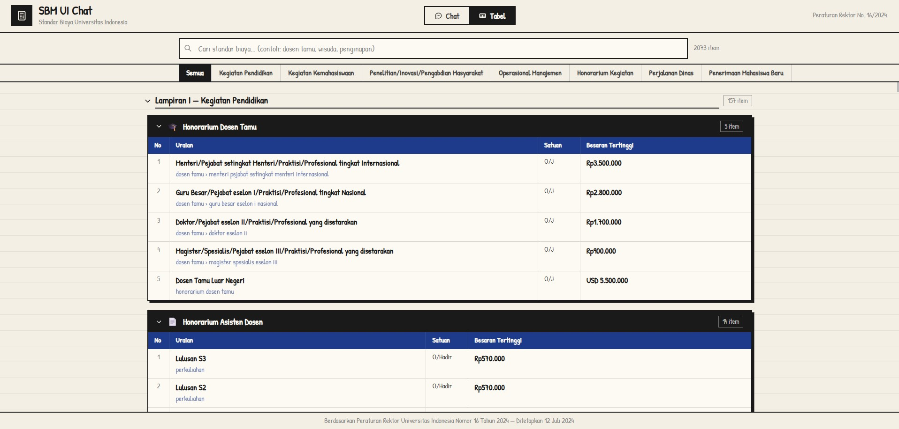

# SBM UI Chat

A chatbot for **Standar Biaya Universitas Indonesia 2024** based on Peraturan Rektor UI No. 16/2024.

Ask it anything about spending limits, honorarium rates, travel allowances, and operational costs — in plain Indonesian — and get an accurate, sourced answer without ctrl+F-ing through a 200-page PDF.

> **Want access to the live deployment?** Reach out to me directly — [bryanjmt04@gmail.com](bryanjmt04@gmail.com)

<video src="SBM UI.mp4" controls width="100%"></video>



---

## Features

- **Chat** — conversational Q&A powered by Gemini, with full context from the regulation

- **Browse** — paginated table view of all ~1,800 line items across 7 lampiran
- **Search** — multi-word cross-field search (e.g. `pesawat ambon` matches rows where "pesawat" is in the category path and "ambon" is in the item name)
- **Streaming** — answers stream token-by-token via Server-Sent Events
- **Markdown tables** — LLM-generated tables render properly in the chat bubble

---

## Stack

| Layer | Tech |
|---|---|
| Backend | FastAPI + Uvicorn |
| LLM | Google Gemini 2.5 Flash Lite (`google-generativeai`) |
| Frontend | Alpine.js + plain CSS (no build step) |
| Font | Patrick Hand (Google Fonts) |

---

## Getting Started

### 1. Clone

```bash
git clone https://github.com/bryanjeshua/sbm-ui-chatbot.git
cd sbm-ui-chatbot
```

### 2. Install dependencies

```bash
pip install -r requirements.txt
```

### 3. Set up environment

```bash
cp .env.example .env
# then edit .env and paste your Gemini API key
```

Get a free key at [aistudio.google.com](https://aistudio.google.com/app/apikey).

### 4. Run

```bash
cd sbm_chatbot
python -m uvicorn main:app --reload
```

Open [http://localhost:8000](http://localhost:8000).

---

## Project Structure

```
sbm_chatbot/
  main.py          # FastAPI app — routes, SSE streaming, LLM context builder
  rules_engine.py  # Full SBM UI 2024 data + search helpers
  static/
    index.html     # Single-file frontend (Alpine.js)

extract_text.py    # One-off: OCR the source PDF via Gemini Vision
order.py           # One-off: structure extracted text into rules_engine.py
check_ambiguity.py # Dev tool: verify disambiguation coverage
```

The regulation data lives entirely in `rules_engine.py` as nested Python dicts — no database required.

---

## Why open source?

Because I can. Because I want to. And because building things for personal enjoyment is one of my favorite activities.

This started when I found myself managing two research grants with a combined budget of Rp 450.000.000 and realised every single rupiah had to comply with a regulation dense enough to make terms & conditions look casual. So I built the tool I wished I'd had.

If you're part of the UI civitas and find this useful, great. If you want to fork it for another university's standar biaya, also great.

---

## License

MIT
